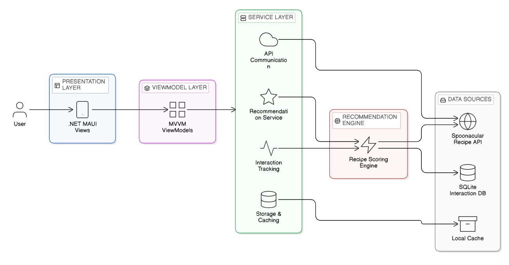

# NutriAI – Behaviour Driven Recipe Recommendation System

**Author:** Sara Hebbadj  
**Programme:** MSc Artificial Intelligence  
**University:** University of Hull  

# Overview

NutriAI is a cross-platform mobile application that generates personalised recipe recommendations based on user behaviour.

Instead of relying on explicit ratings, NutriAI infers user preferences through **implicit interaction signals** such as:

- Viewing recipes  
- Saving recipes  
- Cooking recipes  

These signals are used to dynamically adjust recommendation scores and provide personalised suggestions.

# Key Features

- Behaviour-driven recipe recommendations
- Implicit user preference learning
- Context-aware meal suggestions
- Dietary constraint filtering
- Local interaction tracking
- Cross-platform mobile interface

# Technologies Used

- **.NET MAUI** – cross-platform mobile development  
- **C#** – application logic  
- **MVVM architecture** – separation of UI and logic  
- **SQLite** – local interaction storage  
- **Spoonacular API** – external recipe data  

# System Architecture

The application follows a layered architecture consisting of:

- Presentation Layer (.NET MAUI Views)
- ViewModel Layer (MVVM ViewModels)
- Service Layer (API communication, caching, interaction tracking)
- Recommendation Engine (recipe scoring algorithm)
- External Data Sources (Spoonacular API and SQLite)

# Project Structure

NutriAI/
│
├── Views
├── ViewModels
├── Models
├── Services
├── DTOs
├── Preprocessing

# Running the Application

Full installation instructions are provided in:

Documentation/Installation_Guide.md

# Dissertation Context

This project was developed as part of the MSc Artificial Intelligence programme at the University of Hull.

NutriAI investigates how **behaviour-driven recommendation systems** can support personalised nutrition applications.
