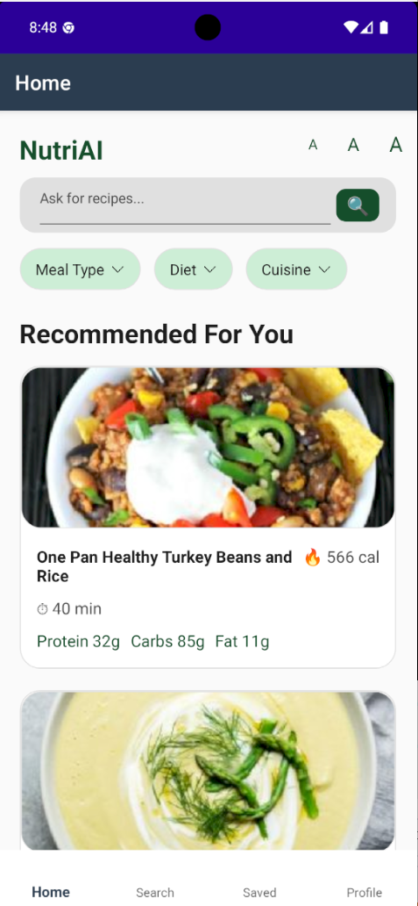
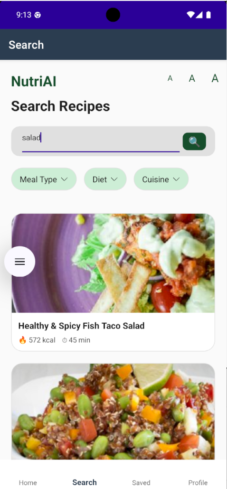
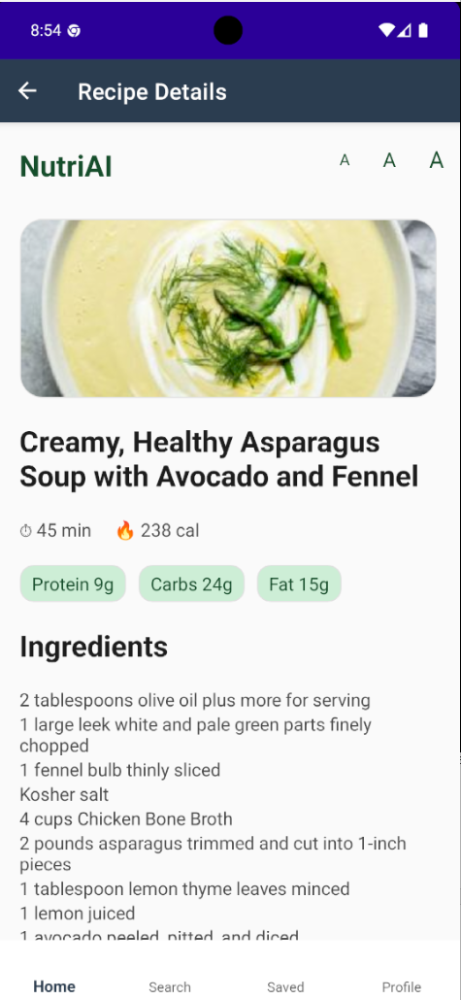
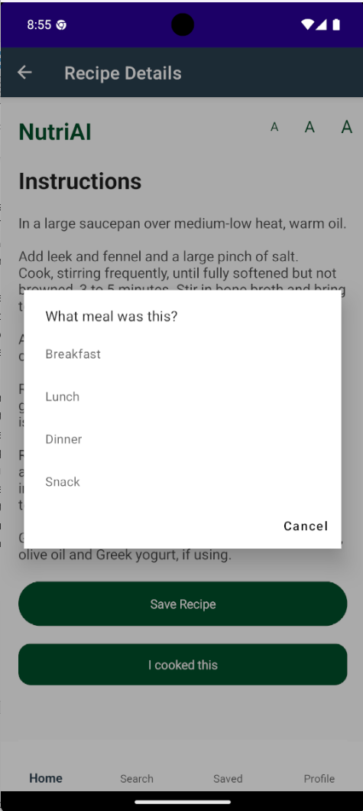
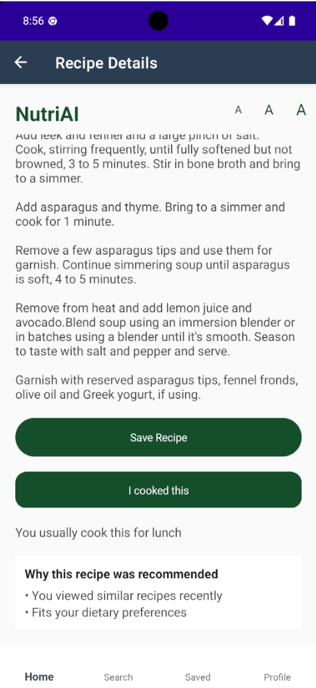
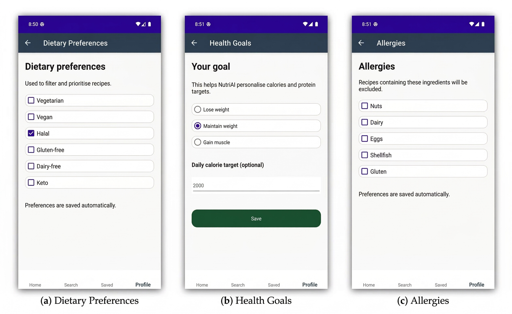
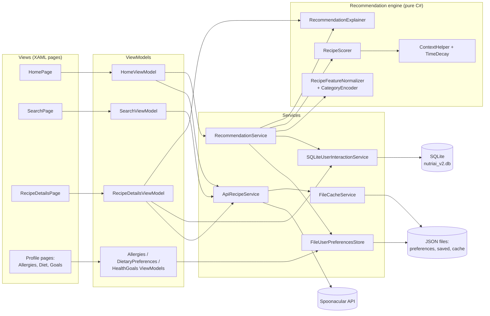

# NutriAI

**Recipe recommendations that learn from what you view, save and cook, and that respect your allergies, diet and health goal.** A .NET MAUI app with a transparent, rule-based scoring engine, now with an xUnit test suite and an offline safety evaluation.

Built by Sara Hebbadj for her MSc Artificial Intelligence dissertation at the University of Hull (2026). This repository is the portfolio version of that code (October 2026): the app is unchanged apart from the small changes listed in [What changed from the dissertation code](#what-changed-from-the-dissertation-code).

> Prototype for learning and demonstration. It is not a medical or allergy-safety product. The tests below show that the keyword filter can miss allergens.

## Demo

Demo video: pending, to be recorded by Sara (onboarding → recommendations → explanation → save/cook → updated ranking).

Screenshots from the dissertation build (Android emulator):

<table>
  <tr>
    <td align="center"><br>Home: "Recommended For You"</td>
    <td align="center"><br>Search</td>
    <td align="center"><br>Recipe details</td>
    <td align="center"><br>"I cooked this" asks for the meal</td>
    <td align="center"><br>"Why this recipe was recommended"</td>
  </tr>
</table>



*Profile settings: dietary preferences, health goal with optional daily calorie target, and allergies.*

## The problem

Recipe apps usually ask people to rate recipes, and most people never do. NutriAI tests a different idea: learn preferences from **implicit behaviour** (opening a recipe, saving it, cooking it), and combine that with the things that must never be ignored: allergies and dietary rules. Every recommendation comes with a short, readable reason, so the user can see why it was suggested.

It is aimed at home cooks with a goal (lose weight, maintain, gain muscle) or a restriction (vegetarian, vegan, halal, gluten-free, dairy-free, keto, or an allergy).

## What it does

- Loads recipes from the [Spoonacular API](https://spoonacular.com/food-api), with a local cache (12 hours for lists, 7 days for details).
- Records views, saves and cooks (with the meal they were cooked for) in a local SQLite database.
- Removes recipes that break an allergy or dietary rule, then ranks the rest with a weighted score: behaviour × recency × meal time × goal and diet weights.
- Shows up to three plain-language reasons per recipe ("You cooked this recipe before", "Good match for lunch", "High in protein for muscle gain").
- Keeps everything on the device: preferences and saved recipes are JSON files; there is no account server.
- New in the portfolio version: 85 automated tests, a 30-user offline evaluation, and a written list of findings with a proposed fix.

## Architecture

The app follows MVVM. Pages bind to view models; view models call services; the recommendation engine is plain C# with no UI or storage code, which is what makes it testable.



Models shared by all layers: `Recipe`, `UserPreferences`, `UserRecipeInteraction`, `RecipeFeatureVector` (in `Models/`). More detail, including the ranking sequence, is in [docs/architecture.md](docs/architecture.md). The original dissertation diagram is [Documentation/System_Architecture.png](Documentation/System_Architecture.png).

## How the recommendation score works

All of this is in [`Services/Recommendation/RecipeScorer.cs`](Services/Recommendation/RecipeScorer.cs) (method `Score`, lines 18–78), called once per recipe by `RecommendationService.Rank` in [`Services/Recommendation/RecommendationService.cs`](Services/Recommendation/RecommendationService.cs).

**Step 1: hard rules first (filter before rank).** If a recipe breaks an allergy or a dietary rule, its score is `0` and `RecommendationService` drops it (`.Where(x => x.Score > 0)`). No amount of past cooking can bring it back. The check looks for keywords in the recipe title and ingredient lines (`ContainsAny`, lines 226–257; keyword lists, lines 260–267):

| Setting | Excluded when the title or ingredients contain a word from |
|---|---|
| Allergy: nuts / dairy / eggs / shellfish / gluten | `NutKeywords` / `DairyKeywords` / `EggKeywords` / `ShellfishKeywords` / `GlutenKeywords` |
| Halal | `PorkKeywords` (pork, bacon, ham, gelatin, ...) |
| Vegetarian | `MeatKeywords` or `FishKeywords` |
| Vegan | meat, fish, dairy or egg keywords |
| Gluten-free / dairy-free | `GlutenKeywords` / `DairyKeywords` |

**Step 2: score what is left.** The final score is a product of six parts:

```
score = behaviour × recency × mealTime × featureWeight × ketoWeight × goalWeight
```

| Part | Formula in the code | Why |
|---|---|---|
| behaviour (lines 36–40) | `0.5 + 0.1·views + 0.6·saves + 1.2·cooks` | Implicit feedback. A view is a weak signal, a save shows intent, cooking confirms the preference. The 0.5 baseline gives unseen recipes a chance. |
| recency (lines 43–44, [`TimeDecay.cs`](Services/Recommendation/TimeDecay.cs)) | `0.5 ^ (daysSinceLastCookOrView / 7)`, or `0.3` if never interacted | A 7-day half-life: last week's favourite counts half as much as today's. |
| mealTime (lines 47–62, [`ContextHelper.cs`](Services/Recommendation/ContextHelper.cs)) | `×1.25` if the recipe's meal type matches the time of day (05–11 breakfast, 11–16 lunch, 16–21 dinner, otherwise snack); "meal" dishes match lunch and dinner | Suggest breakfast in the morning. |
| featureWeight (lines 80–105) | gain muscle: `1 + 0.5·protein`; lose weight: `1.2 − 0.5·calories`; `×0.9` if cooking time is in the top fifth of the list's time range | Uses min–max normalised values (0 to 1 within the current candidate list, [`RecipeFeatureNormalizer.cs`](Preprocessing/RecipeFeatureNormalizer.cs)). |
| ketoWeight (lines 179–186) | keto users: `×1.3` if carbs ≤ 20 g, else `×0.4` | Keto is a soft preference, not an exclusion. |
| goalWeight (lines 188–208) | lose weight: `×1.25` if calories ≤ daily target, else `×0.8`; gain muscle: `×1.3` if protein ≥ 25 g, else `×0.9` | Pushes the ranking towards the goal. |

Worked example: a lunch recipe the user cooked once 7 days ago and viewed once, shown at lunch time to a "maintain" user with no diet: `(0.5 + 0.1 + 1.2) × 0.5 × 1.25 × 1 × 1 × 1 = 1.125`. A recipe never opened scores `0.5 × 0.3 = 0.15` (×1.25 = 0.1875 if it matches the meal time).

**Step 3: explain.** [`RecommendationExplainer.cs`](Services/Recommendation/RecommendationExplainer.cs) builds up to three reasons from the same inputs: history first (cooked > saved > viewed twice), then meal time, diet and goal.

Why rules and not a trained model? There is no labelled data for a new user, the rules are explainable, and a hard exclusion step is easier to check than a learned score. The tests below show what that checking found.

## Results

All numbers below were measured on 8 October 2026 by `dotnet test tests/NutriAI.Tests` (.NET SDK 9.0.318, Linux). No API calls and no AI model are involved: the tests run Sara's real scoring code on **synthetic** data written for this repo (52 recipes with hand-written allergen labels, 30 seeded synthetic users). Full report: [evals/evaluation-2026-10-08.md](evals/evaluation-2026-10-08.md).

**Tests:** 85 passed, 0 failed.

**Filter audit**: each of the 10 hard rules switched on alone, against all 52 recipes (520 decisions):

| | Unsafe recipes missed | Safe recipes wrongly excluded |
|---|---|---|
| Full ingredient lists | 10 / 180 (5.6%) | 56 / 340 (16.5%) |
| Title only (what the home feed has, see finding F1) | 96 / 180 (53.3%) | 7 / 340 (2.1%) |

**30 users × 4 meal times = 120 recommendation lists** (every synthetic user has at least one allergy or dietary rule):

| Measure | Full ingredient lists | Title only (home feed) |
|---|---|---|
| Lists where every recommended recipe is safe | 56 / 120 (46.7%) | 0 / 120 (0.0%) |
| Lists whose top 5 are all safe | 103 / 120 (85.8%) | 29 / 120 (24.2%) |
| Unsafe recipes among top-5 slots | 18 / 580 (3.1%) | 192 / 600 (32.0%) |
| Safe recipes wrongly excluded | 225 / 835 (26.9%) | 27 / 835 (3.2%) |
| Top-5 diversity: mean distinct cuisines (of 5 groups) | 2.98 | 3.29 |
| Recipes appearing in any top 5 | 48 / 52 | 49 / 52 |
| Lists with fewer than 5 recipes left | 16 / 120 | 0 / 120 |

Goals do move the ranking in the right direction (full ingredient lists): mean calories of the top 5 are 347 kcal for "lose weight" users, 395 for "maintain" and 412 for "gain muscle"; mean protein is 22.8 g for "gain muscle" against 19.0 g for "maintain" (catalogue average 437 kcal, 21.7 g).

**Explanations** checked against the score on 5,000 random (recipe, user, history, meal time) cases. Every reason that is shown is factually true (cooked, saved, meal match, goal), but five kinds of mismatch with the score occur. The rates depend on the random mix, so read them as "this happens often", not as a measured user rate:

| Mismatch | Cases |
|---|---|
| History reason shown although the decayed history now lowers the score | 1,779 / 5,000 |
| "You usually cook this for …" shown, but the scorer never uses it | 1,509 / 5,000 |
| "Fits your dietary preferences" although the keto rule cut the score to 40% | 1,484 / 5,000 |
| "You viewed similar recipes recently" for views older than 7 days | 1,177 / 5,000 |
| The strongest factor is not mentioned | 406 / 5,000 |

## What failed and what I changed

The tests found real problems in the dissertation code. They are documented, not hidden: each one has a small test in [`tests/NutriAI.Tests/KnownFindingsTests.cs`](tests/NutriAI.Tests/KnownFindingsTests.cs) that shows today's behaviour, and the full write-up is in [docs/architecture.md → Known issues](docs/architecture.md#known-issues-found-by-the-tests).

| # | Severity | Finding |
|---|---|---|
| F1 | High | The home feed's recipes have **no ingredient list** (`ApiRecipeService.LoadRecipesAsync`, lines 154–167, maps title, nutrition and categories only), so allergy checks only see the title until the user opens the recipe. Example: "Fluffy Buttermilk Pancakes" is shown to a user with a dairy allergy. |
| F2 | High | Allergen words missing from the keyword lists: plurals ("prawns", "mussels", "croutons"), pasta and bread names ("linguine", "bagel"), and composite ingredients ("pesto", "Caesar dressing"). |
| F3 | Medium | Over-exclusion: multi-word keywords are split into single words, so "fish sauce" makes every "sauce" non-vegetarian, "ground beef" makes "ground black pepper" meat, "peanut butter" makes every "butter" a nut, "milk powder" makes "baking powder" dairy. |
| F4 | Medium | Explanations that do not match the score (table above). |
| F5 | Low | "Lose weight" compares one recipe's calories with the **daily** target, so nearly every recipe gets the boost. Goals are soft weights, never hard limits. |
| F6 | Low | Ranking an empty list throws (`Min` of an empty sequence); the home page catches it and shows an empty list. |
| F7 | Info | Old history decays below the "never seen" score: one view more than ~14 days ago ranks a recipe below an unseen one. |
| F8 | Medium | The Search page never applies allergies or dietary rules. |
| S1 | Security | The Spoonacular API key was hard-coded in the published source (two different keys). Removed here; the keys must be rotated. |

**Proposed fix (not applied).** [`proposed-fixes/0001-safer-allergen-filter.patch`](proposed-fixes/README.md) changes the keyword matching to whole phrases with simple plurals, adds missing words, hides recipes with unknown ingredients from users with allergies, keeps ingredient names in the home feed, and makes two explanations honest. Measured on the same data with the patch applied: 0 / 180 unsafe recipes missed and 4 / 340 wrongly excluded with full ingredient lists; 120 / 120 lists safe. **Caution:** the patch was written after seeing these 52 recipes, so this is not independent evidence; it needs new test recipes, and the ingredient mapping needs checking against a live API response. Sara decides whether to apply it.

### What changed from the dissertation code

The scoring, ranking and explanation logic is unchanged. Only these changes were made, each marked "Portfolio change (October 2026)" in the code:

1. **Secrets.** The hard-coded Spoonacular key was removed from `Services/ApiRecipeService.cs`. The key now comes from the `SPOONACULAR_API_KEY` environment variable ([`Services/SpoonacularSettings.cs`](Services/SpoonacularSettings.cs)); on Android, from a git-ignored file (`NutriAI.csproj`).
2. **Testability.** The ranking steps inside `RecommendationService.RankAsync` were moved, unchanged, into a pure `RecommendationService.Rank(...)` method that takes the meal time as a parameter.
3. **Build.** `NutriAI.csproj` excludes the `tests/` folder from the app build, and `NutriAI.sln` now also lists the test project. The standard .NET MAUI 9 Windows platform files (`Platforms/Windows/`) were added from the official template, because the source archive had only Android and iOS.
4. **Repository hygiene.** `Program_Listings/` (dissertation appendix copies of six files; one contained a second API key) was left out. The submitted README is kept as [Documentation/Original_README.md](Documentation/Original_README.md); the installation guide's API-key section was updated.

## How to run

**Windows** (PowerShell; needs the .NET 9 SDK and a free [Spoonacular API key](https://spoonacular.com/food-api/console)):

```powershell
git clone <repository-url> NutriAI; cd NutriAI
dotnet workload restore                              # installs the .NET MAUI workload (Administrator terminal)
setx SPOONACULAR_API_KEY "your-key-here"             # then close and reopen the terminal
dotnet build -t:Run -f net9.0-windows10.0.19041.0    # builds and starts the Windows app
dotnet test tests/NutriAI.Tests/NutriAI.Tests.csproj # runs the 85 tests (no key or network needed)
```

- Visual Studio 2022 (17.10 or later, ".NET Multi-platform App UI development" workload): open `NutriAI.sln`, choose **Windows Machine**, press Run. Restart Visual Studio after `setx` so it sees the key.
- Android emulator: create `Platforms/Android/spoonacular.env` containing one line, `SPOONACULAR_API_KEY=your-key-here`. Git ignores this file. The key is then packed into the app, so do not share that build.
- Without a key the app still starts, but recipe requests fail and the lists stay empty.
- The tests need only the .NET 9 SDK; they also run on macOS and Linux and in GitHub Actions ([.github/workflows/ci.yml](.github/workflows/ci.yml)).

Checked here: the test project on Linux, and the full app built for Android (`net9.0-android`, 0 errors). The Windows build and running the app have not been checked since these changes. That is Sara's first step on Windows.

## Data and licence

- **Recipes in the app** come live from the Spoonacular API under Spoonacular's terms; no Spoonacular data is stored in this repository. The screenshots show Spoonacular recipe photos and titles.
- **Test data** (`tests/NutriAI.Tests/TestData/`) is synthetic, written for this repository: 52 recipes with hand-written allergen labels and 30 generated users. The labels are a developer's judgement, not a dietitian's.
- **Code:** MIT licence, see [LICENSE](LICENSE). Image and font files in `Resources/` keep their own licences (the .NET MAUI template assets are MIT, Open Sans is an open-source font; the source of the icon images is not recorded).

## How I used AI agents

> Draft for Sara to check and edit before publishing.

- **The dissertation app.** [Documentation/Authorship_Statement.md](Documentation/Authorship_Statement.md) states that the project was designed, structured, implemented and documented by Sara, and that "limited AI-assisted tools, including code-completion support, were used in some parts of development for minor boilerplate generation, syntax suggestions, and routine implementation support", not to define the recommendation design, evaluation or dissertation argument. The note at the top of each source file records where GitHub Copilot helped; for example, `RecipeScorer.cs` says Copilot "was used to help draft and refine parts of the scoring implementation" while the scoring logic itself was designed by Sara.
- **This portfolio version (October 2026).** Sara wrote the brief and acceptance tests (secret check, README, xUnit tests for allergens, goals and explanations, a 30-profile evaluation). A coding agent (Claude, by Anthropic, in Claude Code) then did the secret scan, removed the key, made the two small testability and build changes, wrote the synthetic test data, the 85 tests, the evaluation and this documentation, and drafted the proposed fix. The agent did not change the scoring logic.
- **Sara's review:**

> TODO (Sara): run the app on Windows and the tests; list what you checked and what you changed after reviewing.

## Limitations and next steps

- Keyword matching cannot guarantee allergy safety (hidden ingredients, brand products, cross-contamination). A real product would use structured allergen data, for example Spoonacular's `intolerances` search parameter, and say "unknown" when data is missing.
- 52 hand-labelled recipes and 30 synthetic users are a small, author-made test set. Next: a held-out set of new recipes written by someone who has not seen the keyword lists.
- Halal checks pork words only (not alcohol or how meat was slaughtered); the app has no sesame, soy or fish allergy options.
- Single user, single device; no learning across users. A next step would be collaborative filtering once there are several users.
- The `SQLitePCLRaw.lib.e_sqlite3.android` 2.1.11 package has a known high-severity advisory ([GHSA-2m69-gcr7-jv3q](https://github.com/advisories/GHSA-2m69-gcr7-jv3q)); update the SQLitePCLRaw packages.
- Not done yet: demo video, running the app after these changes, and the optional "Explain this recommendation" LLM button from the build spec.
