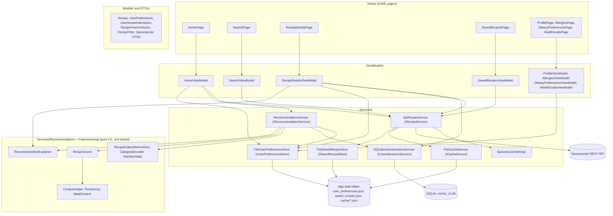
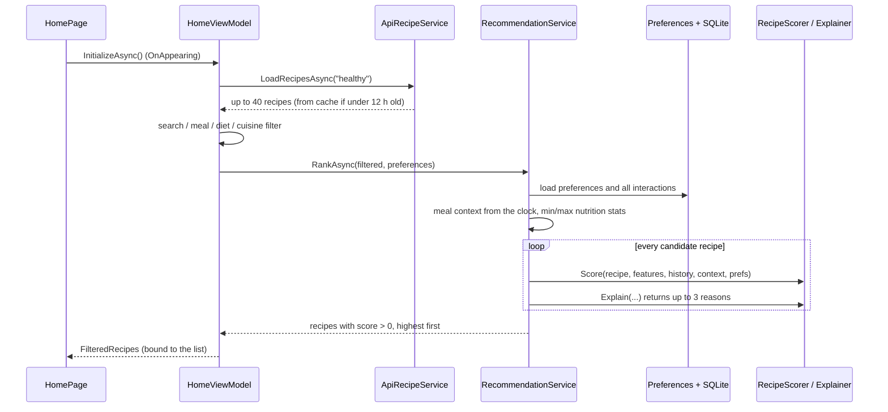

# NutriAI architecture

NutriAI is a single-project .NET MAUI app (C#, .NET 9) using MVVM. Pages bind to view models, view models call services through interfaces registered in `MauiProgram.cs`, and the recommendation engine is plain C# that knows nothing about the UI or storage.

## Layers and files



| Layer | Responsibility | Key files |
|---|---|---|
| Views | Layout and navigation (Shell tabs: Home, Search, Saved, Profile) | `AppShell.xaml`, `Views/*.xaml` |
| ViewModels | Page state, commands, calling services | `HomeViewModel.cs` (filters + ranking), `RecipeDetailsViewModel.cs` (records view/save/cook, builds reasons) |
| Services | API calls, caching, local storage, interaction tracking | `ApiRecipeService.cs`, `Caching/FileCacheService.cs`, `Interactions/SQLiteUserInteractionService.cs`, `Storage/*.cs` |
| Recommendation engine | Filter, score, rank, explain | `Recommendation/RecipeScorer.cs`, `RecommendationService.cs`, `RecommendationExplainer.cs`, `TimeDecay.cs`, `ContextHelper.cs`, `Preprocessing/*.cs` |
| Models | Data shapes shared by every layer | `Models/*.cs`, `DTOs/*.cs` |

## What happens when the home page opens



Opening a recipe records a view (`RecordViewAsync`), loads the full details (ingredients, instructions) and rebuilds the reasons. "Save Recipe" and "I cooked this" record a save or a cook (with the chosen meal). Returning to Home re-runs the ranking, so the order changes after a cook.

## The scoring formula

See the README section "How the recommendation score works" for the full table. In one line:

```
score = 0                                                      if an allergy or diet rule is broken
score = (0.5 + 0.1·views + 0.6·saves + 1.2·cooks)              behaviour
      × 0.5^(days since last cook or view / 7)  (0.3 if none)  recency
      × 1.25 if the meal type fits the time of day             meal context
      × goal feature weight × keto weight × goal weight        preferences
```

## Testability

- `RecommendationService.Rank(candidates, preferences, interactions, context)` is the pure part of `RankAsync`; tests call it with a fixed meal time.
- The test project (`tests/NutriAI.Tests`, plain `net9.0`) compiles the MAUI-free source files by link: `Models/`, `Preprocessing/`, `DTOs/`, `Services/Recommendation/`, the service interfaces, `ApiRecipeService.cs`, `SpoonacularSettings.cs`, `HomeViewModel.cs` and `SearchViewModel.cs`. Files that use MAUI APIs (`FileSystem.AppDataDirectory`, `Shell`, `Command`) stay out.
- `TimeDecay` reads `DateTime.UtcNow`, so tests set timestamps relative to now.
- `NutriAI.csproj` excludes `tests/**` so the app build never compiles test code.

## Configuration and secrets

`ApiRecipeService` reads the Spoonacular key once, from `SpoonacularSettings.GetApiKey()`, which reads the `SPOONACULAR_API_KEY` environment variable. On Android the variable comes from `Platforms/Android/spoonacular.env` (git-ignored), added as an `AndroidEnvironment` item in `NutriAI.csproj` only when the file exists.

## Known issues found by the tests

Found on 8 October 2026 by the tests in `tests/NutriAI.Tests`, which run the app's own scoring files on 52 synthetic labelled recipes and 30 synthetic users. Numbers come from [evals/evaluation-2026-10-08.md](../evals/evaluation-2026-10-08.md). Each issue has a test in `KnownFindingsTests.cs` that asserts today's behaviour, so CI stays green while the problem stays visible. `KnownFindings.cs` lists the known misses and explanation mismatches; the tests compare it with the real behaviour in both directions, so a new problem and a silently fixed one both fail a test.

Status of every issue: **open**. The proposed fix in [`proposed-fixes/`](../proposed-fixes/README.md) is not applied.

### S1 (security): API key in the published source

- **Where:** `Services/ApiRecipeService.cs` (`private const string ApiKey`) and `Program_Listings/ApiRecipeService.txt` in the dissertation zip, which is public on GitHub. The two files hold two different 32-character keys.
- **Found by:** gitleaks 8.21.2 (`generic-api-key`), detect-secrets 1.5.0 (`Hex High Entropy String`, `Secret Keyword`) and a masked regex scan. Key values were never printed.
- **Fixed here:** the key comes from `SPOONACULAR_API_KEY`; `ConfigurationTests` fails if any 32-character hex string appears in a `.cs` file.
- **Still needed (Sara):** regenerate the Spoonacular key(s). The old repository stays public, so the old values must be treated as known.

### F1 (high): the home feed only knows recipe titles

- **Where:** `ApiRecipeService.LoadRecipesAsync`, lines 154–167, maps title, image, time, nutrition, meal type, diet and cuisine, but no `Ingredients`. Ingredients arrive only when the user opens the details page (`RecipeDetailsViewModel.LoadDetailsAsync` copies them onto the same object). The 12-hour list cache also stores recipes without ingredients.
- **Effect:** the allergy check sees the title only; a recipe with unknown ingredients is treated as safe.
- **Test:** `F1_home_feed_shows_an_allergen_recipe_when_only_the_title_is_known` drives the real `HomeViewModel`: "Fluffy Buttermilk Pancakes" is shown to a user with a dairy allergy.
- **Measured (title only):** the filter missed 96 of 180 unsafe recipe–rule pairs; none of the 120 user lists was fully safe; 192 of 600 top-5 slots were unsafe.

### F2 (high): allergen words the keyword lists do not know

`ContainsAny` (lines 226–257) needs an exact word match against the lists on lines 260–267. With full ingredient lists the filter misses 10 of 180 recipe–rule pairs:

| Rule | Recipe | Word not recognised |
|---|---|---|
| nuts | r21 Pesto Pasta Salad | basil pesto (pine nuts) |
| eggs | r09 Chicken Caesar Salad | Caesar dressing (egg yolk) |
| shellfish | r24 Seafood Paella | mussels, king prawns, squid |
| shellfish | r46 Mussels in Tomato Broth | mussels |
| gluten, gluten-free | r09 Chicken Caesar Salad | croutons |
| gluten, gluten-free | r12 Garlic Butter Prawn Linguine | linguine |
| gluten, gluten-free | r50 Smoked Salmon Bagel | bagel |

Plurals are missed because only singulars are listed ("prawn" in a title is caught, "prawns" in the ingredients is not). Pasta and bread names are missing. Composite ingredients need knowledge of what they contain. The pizza and lasagna recipes are excluded for gluten only because "tomato sauce" matches the "sauce" half of "soy sauce" (F3), not because "pizza dough" or "lasagna sheets" are known. Tests: `F2_allergen_word_not_in_the_keyword_list_is_not_excluded`, `F2_the_singular_form_is_caught_but_the_plural_is_not`.

### F3 (medium): safe recipes excluded

`ContainsAny` splits each keyword into single words and matches any of them: "fish sauce" matches every "sauce", "ground beef" matches "freshly ground black pepper", "hot dog" matches "hot sauce", "white flour" matches "white rice", "milk powder" matches "baking powder", "peanut butter" matches every "butter", "almond milk" matches every "milk". Some single keywords are broad too: "stock" and "broth" exclude vegetable stock for vegetarians; "milk" excludes coconut milk for dairy-free users.

Measured: 56 of 340 safe recipe–rule pairs wrongly excluded (16.5%); per user, 225 of 835 safe recipes (26.9%). A nut allergy removes every recipe with butter or milk; vegan users had fewer than 5 recipes left in 16 of 120 lists. This is the safe direction for allergies, but it hides good recipes. Tests: `F3_safe_ingredient_is_excluded_for_a_diet`, `F3_safe_ingredient_is_excluded_for_an_allergy`.

### F4 (medium): explanations that do not match the score

`ExplanationPropertyTests` compares the reasons from `RecommendationExplainer.Explain` with the score parts (from `Helpers/ScoreFactors.cs`, which is checked against the real scorer on 3,000 inputs). Every shown reason is factually true, but on 5,000 random cases (seed 42):

| Mismatch | Cases | Cause |
|---|---|---|
| History reason shown although decayed history now scores below a never-seen recipe | 1,779 | Explainer ignores recency (see F7) |
| "You usually cook this for …" shown, but the scorer never uses `LastUsedMealType` | 1,509 | Explainer lines 31–35 |
| "Fits your dietary preferences" although the keto rule cut the score to 40% | 1,484 | Explainer lines 69–80 skip the keto rule |
| "You viewed similar recipes recently" for views over 7 days old (and it is the same recipe) | 1,177 | Explainer line 47 |
| Strongest factor not named (for example protein for "gain muscle" under 25 g, or one view) | 406 | Explainer covers only some factors |

The rates depend on the random mix, so they show that each mismatch happens, not how often a real user sees it. Tests: three `F4_...` tests.

### F5 (low, design): the calorie goal compares one meal with a whole day

`ComputeHealthGoalWeight` checks `recipe.Calories <= prefs.DailyCalorieTarget`. With an 1,800 kcal daily target every test recipe (160–700 kcal) gets the 1.25 boost, so it changes nothing; the normalised calorie weight (`1.2 − 0.5·calories`) still prefers lighter recipes (top 5 averaged 347 kcal for "lose weight" users against 395 for "maintain"). Goals are soft weights, never limits. Test: `F5_daily_target_gives_the_same_boost_to_a_light_and_a_heavy_meal`.

### F6 (low): ranking an empty list throws

`Rank` computes `Min`/`Max` over the candidates and throws `InvalidOperationException` when there are none (for example a search with no match). `HomeViewModel.ApplyAllFilters` catches it, so the user sees an empty list: the right result, reached by accident. Test: `F6_empty_candidate_list_throws_but_the_home_page_catches_it`.

### F7 (info, design): old history ranks below "never seen"

With no history the recency weight is 0.3. One view decays to the same score after 14 days (`0.6 × 0.5² = 0.15 = 0.5 × 0.3`) and below it afterwards; a cooked recipe falls below after about 25 days. This may be intended ("forget old interests") but should be a decision, not a side effect. Test: `F7_an_old_view_ranks_below_a_never_seen_recipe`.

### F8 (medium): the Search page ignores allergies and diets

`SearchViewModel` ranks by text, meal type, diet and cuisine only; it never sees the user's preferences or calls the scorer. A user with a nut allergy who searches "peanut" sees peanut recipes. Test: `F8_search_page_shows_recipes_that_break_the_users_allergies`. Possible fix (not written as a patch): inject `IUserPreferencesStore` and drop results where `RecipeScorer.Score(...) == 0`, or show them with a warning.

### Other observations

- `RecommendationService.RankAsync` ignores its `UserPreferences` argument and reloads preferences from the store (test `RankAsync_uses_the_stored_preferences_and_history`). Harmless, but misleading.
- `SQLitePCLRaw.lib.e_sqlite3.android` 2.1.11 has a known high-severity advisory (NuGet NU1903, GHSA-2m69-gcr7-jv3q).
- The source archive had no `Platforms/Windows` folder although `NutriAI.csproj` targets Windows; the standard template files were added.
